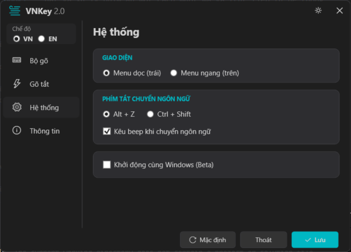
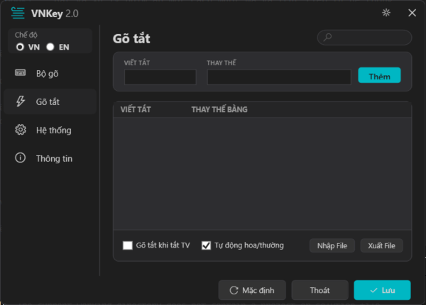
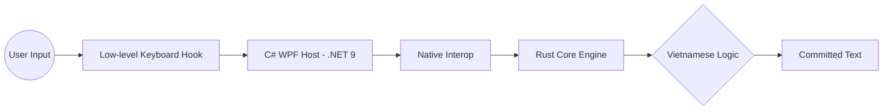

# VNKey: The Ultimate Vietnamese Input Method Engine 🚀

[](https://www.rust-lang.org/)
[](https://dotnet.microsoft.com/)
[](LICENSE)

**VNKey** là bộ gõ tiếng Việt thế hệ mới, được thiết kế để định nghĩa lại tiêu chuẩn về tốc độ, độ ổn định và tính thẩm mỹ. Kết hợp sức mạnh của **Rust Core** và sự linh hoạt của **Modern WPF**, VNKey mang đến trải nghiệm gõ phím không giới hạn cho các nhà phát triển, người sáng tạo nội dung và người dùng chuyên nghiệp.

---

## 📸 Trải Nghiệm Thị Giác (UI Showcase)

VNKey sở hữu giao diện tối giản nhưng mạnh mẽ, hỗ trợ đầy đủ Dark Mode và các hiệu ứng mượt mà của hệ điều hành hiện đại.

<p align="center">
  
  
</p>
<p align="center">
  
  
</p>

---

## 🔥 Các Tính Năng Đột Phá

### ⚙️ Lõi Xử Lý (Typing Engine)
- **Đa phương thức:** Hỗ trợ đầy đủ các kiểu gõ phổ biến: **Telex, VNI, VIQR**.
- **Smart English Detection:** Tự động nhận diện và bỏ qua xử lý khi người dùng gõ từ tiếng Anh (như code, từ chuyên ngành) mà không cần chuyển chế độ thủ công.
- **Syllable Validation:** Kiểm tra cấu trúc ngữ âm học tiếng Việt thời gian thực, ngăn chặn việc gõ sai dấu hoặc sai vần ngay từ đầu.
- **Modern Tone placement:** Cho phép tùy chọn đặt dấu theo kiểu mới (chuẩn khoa học) hoặc kiểu cũ (truyền thống).

### 🚀 Hiệu Năng Vượt Trội
- **Rust Powered:** Lõi xử lý được viết bằng Rust cho độ trễ gần như bằng 0 và độ an toàn bộ nhớ tuyệt đối.
- **Zero Interruption:** Không bao giờ gây treo ứng dụng (như Word, Excel, Chrome) nhờ kiến trúc xử lý phím không đồng bộ.
- **Low-level Hook Optimization:** Tối ưu hóa việc bắt phím ở cấp độ sâu nhất của Windows, đảm bảo sự mượt mà kể cả khi máy đang tải nặng.

### 🎨 Tùy Biến Sâu (Customization)
- **Advanced Shorthand (Macros):** Hệ thống gõ tắt mạnh mẽ. Cho phép Thêm/Xóa/Tìm kiếm, đặc biệt hỗ trợ **Import/Export** danh sách gõ tắt từ các bộ gõ khác.
- **Expand on Enter/Space:** Tùy chọn kích hoạt gõ tắt linh hoạt.
- **Sound Feedback:** Hỗ trợ âm thanh thông báo (Beep) khi chuyển trạng thái hoặc gặp lỗi gõ.
- **Tray Integration:** Thu gọn vào Taskbar, hoạt động thầm lặng nhưng luôn sẵn sàng.

---

## 🏗️ Kiến Trúc Hệ Thống

VNKey được thiết kế theo mô hình **Core-Host** để đảm bảo tính module và khả năng mở rộng:



- **Core (Rust)**: Xử lý logic ngữ âm, bộ đệm ký tự và tính toán dấu. Xuất bản dưới dạng thư viện liên kết động (`.dll`).
- **Host (C# WPF)**: Quản lý giao diện, cài đặt người dùng và tương tác trực tiếp với hệ điều hành Windows.

---

## 🛠️ Hướng Dẫn Kỹ Thuật (Cho Developer)

Nếu bạn muốn build VNKey từ mã nguồn hoặc tích hợp lõi vào dự án riêng:

### Yêu Cầu
- Windows 10/11
- [Rustup](https://rustup.rs/) (v1.75+)
- [.NET 9+ SDK](https://dotnet.microsoft.com/en-us/download/dotnet/9.0)
- Visual Studio 2022+ / Rider

### Các bước Build
1. **Biên dịch lõi Rust:**
   ```powershell
   cd core
   cargo build --release
   ```
2. **Setup Native DLL:**
   Copy `target/release/vnkey_core.dll` vào thư mục `Native/` của dự án Windows.
3. **Chạy ứng dụng WPF:**
   ```powershell
   dotnet run --project platforms/windows/VNKey.Windows
   ```

---

## 🤝 Đóng Góp & Giấy Phép
Mọi đóng góp (Issue, PR) đều được chào đón để bộ gõ ngày càng hoàn thiện hơn. 

Dự án được phát hành dưới giấy phép **[MIT](LICENSE)**.

**Sáng tạo bởi Van Quoc Bui & Cộng đồng mã nguồn mở.**
