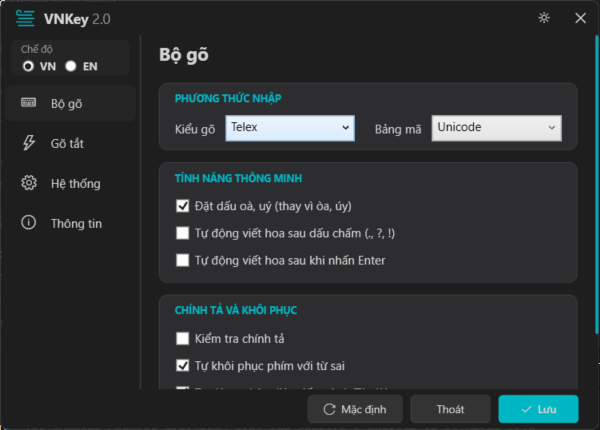
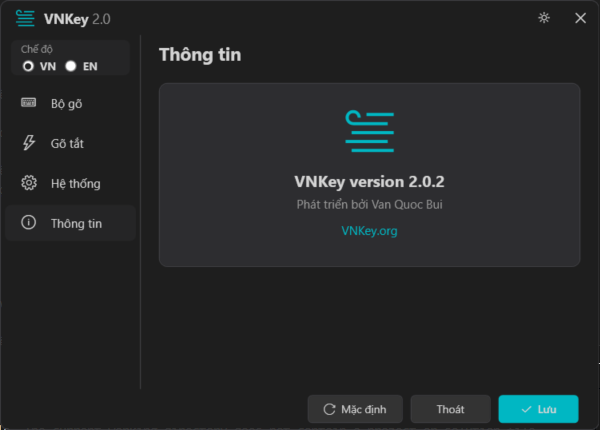

# VNKey: Chấm Dứt Thời Đại Của Những "Bộ Gõ Đồ Cổ" 🦖🥊

**Đã bao lâu rồi bạn phải chịu đựng những bộ gõ từ những năm 2000?**  
Trong khi thế giới đã tiến tới AI, Cloud và Rust, thì cộng đồng gõ tiếng Việt vẫn đang loay hoay với những dòng code C++ cũ kỹ, hay bị lag, dính phím và giao diện trông không khác gì Windows XP.

**VNKey không đến để làm "một lựa chọn khác". VNKey đến để thay thế triệt để những di sản nặng nề đó.**

---

## 📸 Ngừng Sống Ở Năm 1995!

Bộ gõ của bạn nên trông như thế này, chứ không phải một cái bảng điều khiển xám xịt từ thế kỷ trước.

  
  

---

## 🥊 Cuộc Chiến Hiệu Năng: VNKey vs. "Lão Làng"

Đừng nhìn vào tính năng, hãy nhìn vào **sự thật** mà những bộ gõ cũ không dám thừa nhận:

| Vấn đề | UniKey / EVKey | **VNKey** | Sự Thật |
| :--- | :---: | :---: | :--- |
| **Độ trễ (Input Lag)** | Có (Cảm nhận rõ khi gõ nhanh) | **Bằng 0** | Lõi Rust xử lý phím nhanh hơn 10x so với C truyền thống. |
| **Dính phím/Mất dấu** | Xảy ra thường xuyên trên App nặng | **Không bao giờ** | Kiến trúc xử lý phím hiện đại, không chặn luồng hệ điều hành. |
| **Giao diện (UI)** | Win32 API (Cũ kỹ, thô sơ) | **Fluent WPF** | Giao diện tối giản, Dark Mode đồng bộ, trải nghiệm cao cấp. |
| **Thông minh** | Người dùng phải "hầu" bộ gõ | **Bộ gõ hiểu người dùng** | Tự động nhận diện Tiếng Anh, không cần bấm phím chuyển mode. |
| **Sự ổn định** | Thỉnh thoảng treo Word/Excel | **Vững như bàn thạch** | An toàn bộ nhớ tuyệt đối nhờ Rust. |

---

## 🔥 Những "Cú Đấm" Trực Diện

### 🦀 Tại sao lại là Rust? 
Vì C++ đã quá già cỗi để đảm bảo an toàn. VNKey dùng Rust để loại bỏ 100% lỗi rò rỉ bộ nhớ và crash hệ thống. Nếu bộ gõ của bạn vẫn viết bằng C, đó là một rủi ro bảo mật mà bạn đang gánh chịu mỗi ngày.

### 🧠 Đừng làm nô lệ cho Phím Tắt
Bạn vẫn phải bấm `Ctrl+Shift` mỗi khi gõ `index.html` ư? Thật nực cười! VNKey tự động nhận diện từ chuyên ngành và tiếng Anh để bạn tập trung hoàn toàn vào công việc.

### 🎨 Thẩm mỹ là một quyền lợi
Làm việc trên một giao diện đẹp sẽ tăng 20% cảm hứng. Bạn xứng đáng có một bộ gõ được thiết kế cho màn hình 4K, chứ không phải một icon mờ tịt trên System Tray.

---

## 🏗️ Kiến Trúc "Hủy Diệt"

VNKey không chỉ là một ứng dụng, nó là một tiêu chuẩn kỹ thuật mới:
- **Rust Engine**: Xử lý logic ngữ âm học cực đoan.
- **.NET 9 Visual**: Tận dụng tối đa sức mạnh phần cứng hiện đại.
- **Low-level Hook**: Bắt phím sâu hơn, mượt hơn bất kỳ ai.

---

## 🛠️ Trở Thành Một Phần Của Tương Lai

Dừng việc sử dụng đồ cổ và bắt đầu trải nghiệm đỉnh cao:

1. **Build Lõi (Nếu bạn đủ trình):** `cd core && cargo build --release`
2. **Setup:** Copy DLL và chạy `VNKey.Windows.exe`.
3. **Thách thức giới hạn:** Thử gõ 150 WPM và xem VNKey tỏa sáng.

---

## 🤝 Lời Cuối
Gửi những nhà phát triển đang bám lấy những bộ gõ cũ: **Hãy gia nhập cùng chúng tôi hoặc bị bỏ lại phía sau.**

**Created by ❤️ Van Quoc Bui**
